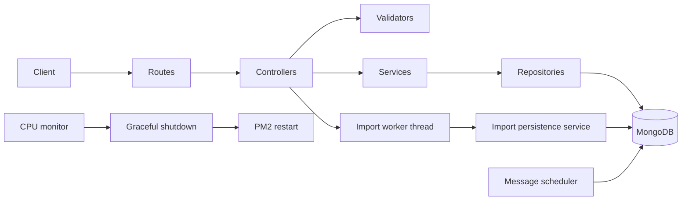

# Policy Data Service

A Node.js service for importing insurance policy data from CSV/XLSX files, searching and aggregating policies, and scheduling messages for later delivery. It also includes a small CPU monitor for deployments managed by PM2.

## Architecture

The application is split into routes, controllers, services, and persistence code. Spreadsheet parsing runs in a worker so a large import does not block normal API requests.



```text
src/
├── config/          # environment parsing and database lifecycle
├── constants/       # shared domain constants
├── controllers/     # HTTP request/response orchestration
├── errors/          # operational error types
├── middleware/      # uploads and centralized error handling
├── models/          # one Mongoose schema per collection
├── repositories/    # database queries and aggregation pipelines
├── routes/          # endpoint declarations only
├── services/        # application use cases and background processing
├── utils/           # framework-independent helpers
├── validators/      # request validation and normalization
├── workers/         # worker-thread entry points
├── app.js           # Express composition
└── server.js        # process lifecycle and graceful shutdown
```

## Technology choices

- **Express** provides a small, familiar HTTP layer.
- **Mongoose/MongoDB** model independently reusable insurance entities with references.
- **Multer** streams multipart uploads to temporary disk storage and enforces a size limit.
- **ExcelJS** and **csv-parse** parse the two required input formats inside a worker thread.
- **Node worker threads** isolate CPU-heavy parsing and normalization from the API event loop.
- **PM2** supervises the process and performs the actual restart after a controlled non-zero exit.
- **Node's built-in test runner** keeps the test setup lightweight.

## Data model

| Collection | Key fields | Constraints and references |
| --- | --- | --- |
| `agents` | `agentName` | required, unique, indexed |
| `users` | `userKey`, `firstName`, profile fields | `userKey` unique; name and email indexed |
| `accounts` | `accountKey`, `accountName`, `user` | unique key; `user → users._id` |
| `lobs` | `categoryName` | required, unique, indexed |
| `carriers` | `companyName` | required, unique, indexed |
| `policies` | `policyNumber`, dates, entity references | policy number unique; all references indexed; compound `{ user, policyStartDate }` index |
| `messageschedules` | message, due time, status, attempts | compound `{ status, scheduledFor }` index |
| `messages` | message, schedule | unique `schedule` reference makes processing idempotent |

References are preferred over embedding because agents, carriers, LOBs, and users are shared by many policies and must be updated independently. ZIP codes, phone numbers, and policy numbers remain strings so leading zeroes are preserved. A normalized email identifies a user when present; otherwise a deterministic composite key is used.

## Local setup

Requirements: Node.js 20+ and MongoDB 7+.

```bash
npm install
copy .env.example .env
npm test
npm start
```

Set `MONGODB_URI` in `.env`. By default the service listens at `http://localhost:3000`.

| Variable | Default | Purpose |
| --- | ---: | --- |
| `PORT` | `3000` | HTTP port |
| `MONGODB_URI` | required | MongoDB connection string |
| `MAX_UPLOAD_MB` | `25` | upload limit |
| `MESSAGE_SCHEDULER_INTERVAL_MS` | `1000` | due-message polling interval |
| `CPU_RESTART_THRESHOLD` | `70` | host CPU percentage that initiates restart |
| `CPU_SAMPLE_INTERVAL_MS` | `5000` | CPU sampling interval |
| `LOG_FORMAT` | `dev` | Morgan request log format |

## API conventions

Every endpoint returns the same envelope:

```json
{
  "success": true,
  "message": "Human-readable result",
  "data": {},
  "meta": {}
}
```

Errors use `success: false`, `data: null`, an appropriate HTTP status, and optional `details`.

### Health

```http
GET /health
```

### Import CSV/XLSX

```http
POST /api/import
Content-Type: multipart/form-data
```

```bash
curl -X POST http://localhost:3000/api/import -F "file=@data-sheet.csv"
```

The uploaded file is deleted after either success or failure. Parsing, row normalization, deduplication, and unordered bulk upserts execute in `src/workers/import.worker.js`; the main event loop remains available to serve requests. The response reports source rows, unique policies processed, inserted/updated/matched policies, entity counts, rejected rows, and up to 20 validation errors. Re-uploading the same file is idempotent because stable unique keys are upserted.

### Search policies by user

```http
GET /api/policies/search?username=Lura
```

The literal, case-insensitive search checks first name and email, then loads related policies with agent, account, LOB, carrier, and user details. User input is escaped before constructing the regular expression.

### Aggregate policies by user

```http
GET /api/policies/aggregate?page=1&limit=25
```

`/api/policies/by-user` remains as a compatibility alias. A single aggregation uses `$group`, `$sort`, `$facet`, `$lookup`, and `$project`; only the requested page receives relationship lookups. `limit` is capped at 100.

### Schedule a message

```http
POST /api/messages/schedule
Content-Type: application/json

{
  "message": "Policy renewal reminder",
  "day": "2026-09-25",
  "time": "14:30",
  "utcOffset": "+05:30"
}
```

The date must be in the future. When `utcOffset` is omitted, the server timezone is used. The request returns immediately after persistence. A background scheduler atomically claims due records and moves them through `SCHEDULED → PROCESSING → COMPLETED`; after three failures a record becomes `FAILED`. The unique message-to-schedule index prevents duplicate delivery records.

```http
GET /api/messages/schedule/:id
```

## CPU monitoring and restart

The monitor compares cumulative `os.cpus()` snapshots and calculates utilization over each sampling window. At the threshold it stops sampling, enters the application's graceful-shutdown path, stops background work, closes the HTTP server, disconnects MongoDB, and exits with code `1`.

Run under PM2 so another process owns restart responsibility:

```bash
npm run start:pm2
pm2 logs policy-api
```

The ownership chain is `PM2 → Node.js process`; PM2 sees the non-zero exit and restarts with exponential backoff. In a real production platform, infrastructure metrics and Kubernetes/systemd/PM2 restart policies are preferable to an in-process CPU rule because they continue working even when the Node.js event loop is unhealthy.

## Testing

```bash
npm test
```

Unit tests cover CSV/XLSX parsing, import mapping and invalid rows, date/time construction, validation boundaries, regex escaping, environment parsing, and CPU-utilization calculations. Database-integrated endpoint and scheduler tests should run against a disposable MongoDB instance in CI.

## Performance and production notes

- Worker threads protect the event loop from spreadsheet parsing and normalization work.
- Unordered `bulkWrite` operations reduce database round trips and allow independent writes to continue.
- Unique indexes enforce idempotency under concurrent imports.
- Pagination and server-side aggregation avoid materializing the entire policy collection in application memory.
- For files much larger than the configured limit, use streaming CSV batches and an asynchronous upload-job API rather than keeping an HTTP request open.
- At multi-node scale, move scheduling to BullMQ/Redis (or a managed queue) and imports to dedicated worker processes with object storage.
- Add authentication, authorization, rate limiting, audit logs, TLS, secret management, and malware scanning before public exposure.

See [docs/DESIGN_NOTES.md](docs/DESIGN_NOTES.md) for notes on the main design decisions and trade-offs.
